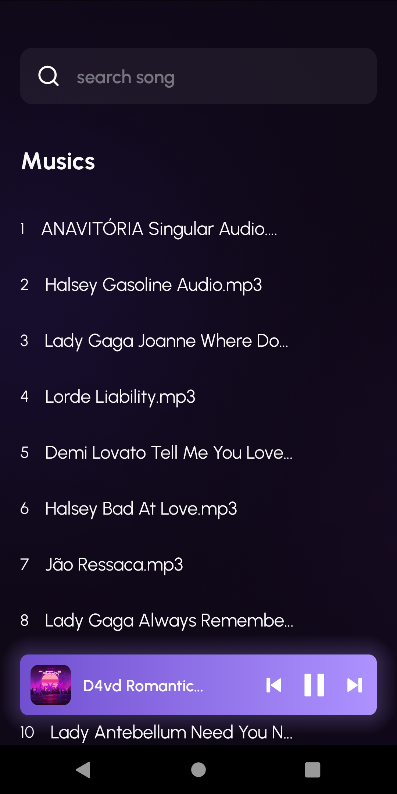

# DIEMU 🎵

### Simple player of music to playing your favorites music 🎧

Ui original make by Vittorio Ewing  [figma](https://www.figma.com/community/file/1147244677060526674)

⬇️ [Download apk](https://expo.dev/artifacts/eas/77xg8MZHksgiY2rYhrqfMh.apk)


<center>
  
</center>


# Tecnologias 

* Typescript
* Expo
* Expo-av
* Expo-media-library
* Expo-icons
* notifee/react-native
* react-native-async-storage
* react-native-shadow
* react-native-svg


</br>
</br>

⚠️ case be used expo go not will working, you need create a [custom development client](https://docs.expo.dev/development/create-development-builds/)


# how use 

### 1. Clone this repository

* ```
  git clone
  ```

### 2. Go repository

* ```
  cd Diemu
  ```

### 3. Install dependencies

* ```
  yarn or npm install
  ```

### 4. Execute app

* ```
  npx expo run:android
  ```
  


